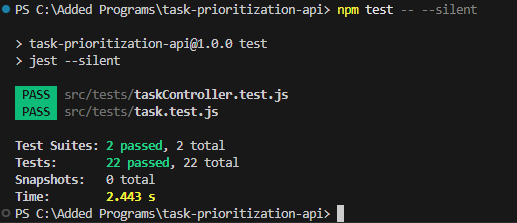
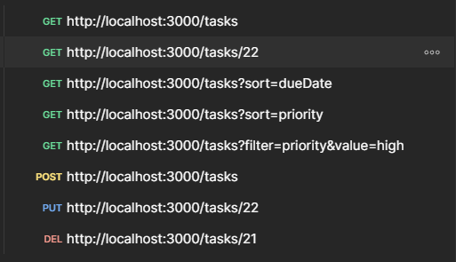

# task-prioritization-api
A RESTful API for task prioritization with smart priority calculation

# Task Prioritization API

A RESTful API that allows users to create, read, update, and delete tasks while introducing a smart priority system based on predefined business rules and user-defined parameters.

## Features

- **CRUD Operations**: Create, read, update, and delete tasks
- **Smart Priority Calculation**: Automatically determine task priority based on business rules
- **Task Sorting**: Sort tasks by priority or due date
- **Task Filtering**: Filter tasks by completion status or priority level
- **Persistent Storage**: PostgreSQL database for data storage

## Tech Stack

- **Backend**: Node.js with Express.js
- **Database**: PostgreSQL with Sequelize ORM
- **Testing**: Jest

## Setup Instructions

### Prerequisites

- Node.js (v14+)
- PostgreSQL (v13+)
- npm

### Installation

1. Clone the repository
   ```bash
   git clone https://github.com/Kolpic/task-prioritization-api.git
   cd task-prioritization-api

### Libraries and Modules Used in Project:

express: A web framework for Node.js that handles routing, middleware, and HTTP requests/responses.
sequelize: The ORM library that interfaces with your PostgreSQL database. (I use orm for the first time)
pg: The PostgreSQL client for Node.js that Sequelize uses under the hood.
body-parser: Middleware to parse incoming request bodies (included in Express, but you're using it separately).
dotenv: Loads environment variables from a .env file.

### Project Structure Explanation:

config/database.js: Configures Sequelize connection to PostgreSQL.
models/task.js: Defines Task model with fields, validations, and data types.
models/index.js: Initializes and exports models.
controllers/taskController.js: Contains the logic for handling HTTP requests related to tasks.
routes/taskRoutes.js: Defines API endpoints and connects them to controller methods.
utils/priorityCalculator.js: Contains business logic for calculating task priorities.
app.js: Sets up Express application, and routes.
server.js: Starts the HTTP server.

### Commands to start the project
node src/server.js
npm run dev

### Commands to run the tests
npm test -- --silent



